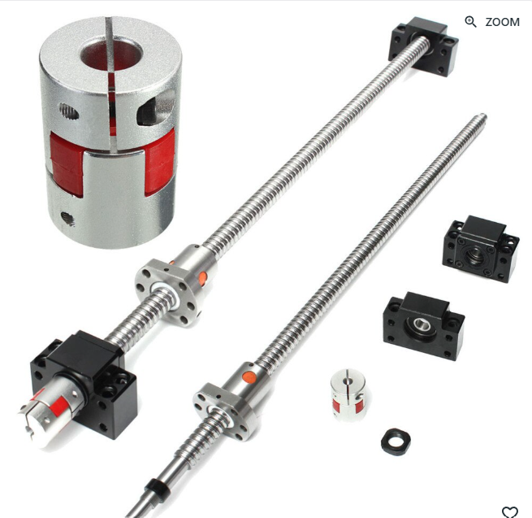

# Purchase list
| Item | Description                | Quantity    | Value    | Price (€) |
|------|----------------------------|-------------|----------|-----------|
| 1    | Current extrusion          | 1           | -        | 0         |
| 2    | Current extrusion die      | 1           | -        | 0         |
| 3    | Linear rails               | 1 couple    | -        | 100-200   |
| 4    | Linear rails motor         | 1           | -        | -         |
| 5    | Cylinder                   | 1           | d250mm   | 400-600   |
| 6    | Infrared Lamp              | 1           | 1-2 kW   | 140       |
| 7    | beckhoff plc cx2020n031    | 1           | -        | 350       |
| 8    | ethercatmotordriver+motor  | 1           | 400W     | 146,95    |
| 9    | ball and screw system      | 1           |          | 85        |

## PLC
The budget friendly beckhoff plc cx2020n031, can be used as ethercatmaster and can be programmed with twincat.
buy: https://nl.wiautomation.com/beckhoff/plc-systems/other/cx2020n031
manual: https://download.beckhoff.com/download/document/ipc/embedded-pc/embedded-pc-cx/cx2000_en.pdf 

## Linear rails

## servo motor
Ethercat servo motor kit
buy: https://www.stepperonline.nl/a6-serie-400w-sto-safe-torque-off-ethercat-ac-servomotor-kit-3000rpm-1-27nm-17-bits-absoluut-encoder-ip67-a6-ec400h2a1-m17-sto

## ball screw

buy: https://vicedeal.com/products/set-van-antibacklash-kogelomloopspindel-500-mm-sfu1605-1605-l360mm-c7-bk-bf-12-ondersteuning-base-6-35x10mm-koppelingen?variant=UHJvZHVjdFZhcmlhbnQ6MjI3OTc3ODA5&gad_source=1&gad_campaignid=17178483267&gbraid=0AAAAAC0mFLbkjbIFuMOxI4xnwGNgqU62c&gclid=CjwKCAiA64LLBhBhEiwA-Pxgu2uZYB5Qnn4znjGpT43n_O2PMl5KYRP9drlP9FBzEBCWw2nYTp2f8BoCsaoQAvD_BwE
datasheet: 
https://www.handsontec.com/dataspecs/linear%20motion/Ball%20Screw-Kit-1605.pdf 

## Infrared lamp

## Cylinder

