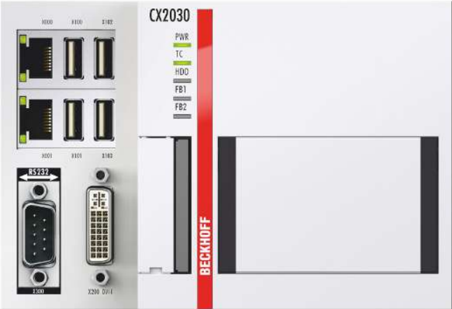

# Purchase list and CAD Design
| Item | Description           | Quantity    | Value    | Price (€) |
|------|----------------------|------------|---------|-----------|
| 1    | Current extrusion     | 1          | -       | 0         |
| 2    | Current extrusion die | 1          | -       | 0         |
| 3    | Linear rails          | 1 couple   | -       | 100-200   |
| 4    | Linear rails motor    | 1          | -       | -         |
| 5    | Cylinder              | 1          | -       | -         |
| 6    | Infrared Lamp         | 1          | 1-2 kW  | 140       |

# Linear rails

# Infrared lamp

# PLC

The budget friendly beckhoff cx2020n031 is chosen
manual:
https://download.beckhoff.com/download/document/ipc/embedded-pc/embedded-pc-cx/cx2000_en.pdf
buy for 350 euros:
https://nl.wiautomation.com/beckhoff/plc-systems/other/cx2020n031